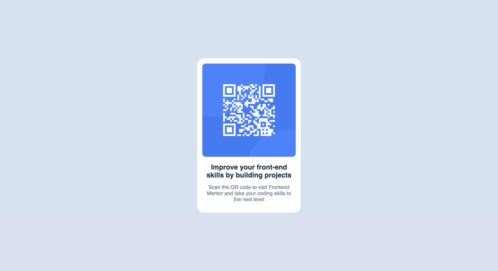

Overview

This is a solution to the QR code component challenge on Frontend Mentor. It is the first project in the React learning path, and my starting point for practicing React and improving my frontend skills.

Screenshot

Links

Live Site URL: [https://qrcode-learningpaths.netlify.app/]

Solution URL: [https://github.com/Gnani31/QR-Code]

My process

Built with

Semantic HTML5 markup

CSS (external CSS for clean code)

React

Vite - for fast development build

What I learned

How to set up a React project using Vite

How to handle static assets (like images) in modern React

The importance of using new URL(..., import.meta.url).href for static asset compatibility while building with parcel

Continued development

Going forward, I plan to:

Practice component composition

Use external CSS or styled-components

Add responsiveness and accessibility improvements

Useful resources

Vite Static Assets Guide - Helped me resolve image loading issues

React Docs - For foundational concepts and patterns

Frontend Mentor - Great for real-world UI practice

Author

GitHub - Gnani31

Frontend Mentor - @Gnani31

Acknowledgments

Big thanks to the Frontend Mentor team for providing structured and practical challenges. This first step has been both educational and motivating!

